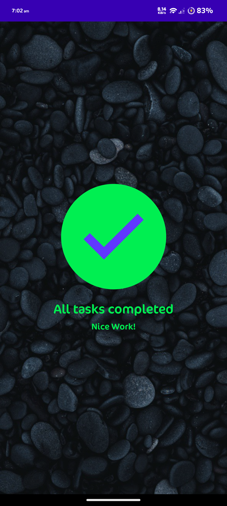

# TaskManager_Compose
task manager app's completed tasks page using Kotlin and Compose
  <a href="https://developer.android.com/courses/android-basics-compose/course" >Android Basics with Compose Tutorial</a>  
<h1>Screenshot</h1>

